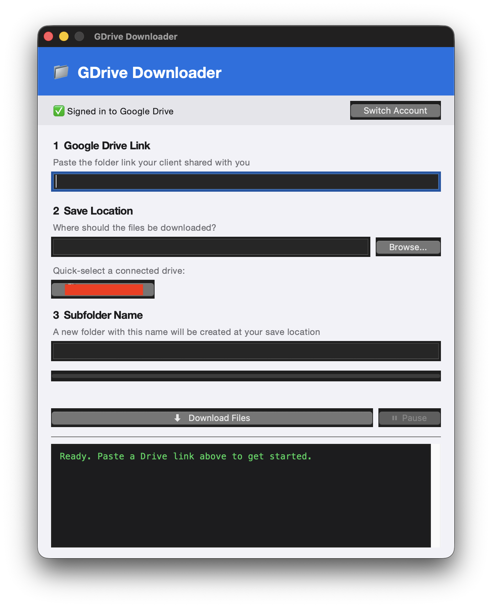

We get a lot of footage from clients. Big folders, heavy video files, shared over Google Drive. And for the longest time, the workflow was: click download, wait for Google to zip it, watch it split into six parts, hope none of them fail halfway through. For a couple of files, fine. For a folder full of raw footage from a shoot, it was a genuine pain. Slow, unreliable, and somehow always failing right at the point you needed the files most.

So I figured I'd fix it. I did learn to code once, DOS and C++ back in school and college, but that's two decades and a whole career in filmmaking ago. Hasn't come up since. But I've been using Claude as an extended search tool for a while now, and at some point it stopped feeling like a stretch to ask it to help me build an actual tool instead. So that's what this is. Something built with two-decade-old, mostly-forgotten coding knowledge, working through it step by step with AI doing the actual writing while I described what I needed and pushed back when it wasn't right.

First stop was rclone, a command line tool that's built for exactly this kind of job, moving files in and out of cloud storage properly. Handles big files, resumes if it drops, and you can point it at a specific folder instead of grabbing everything. First version was a shell script wrapped around it, paste a link, it pulls the folder ID out, starts the download. Worked. Except it meant everyone on the team had to be comfortable opening Terminal, and let's be honest, that was never going to happen.

So the script became an app. A proper little interface, paste the link, pick a save location, hit download.

Added a progress bar, a pause and resume button, a log window so you could see what was actually happening under the hood. Three steps, no Terminal, done.

Getting it onto everyone's machines was its own fight. The usual way to package this kind of app didn't play nice with the Mac versions we're running across the office, so I ended up going the unglamorous route, a script that finds the right install on the machine and just runs the thing. Not elegant. Worked on every machine though, and that was all that mattered.

Then came the bug that actually scared me a bit. The app started downloading the entire shared drive instead of the one folder someone asked for. Traced it back to two rclone flags quietly fighting each other, one telling it to grab everything shared with you, the other telling it to grab just this folder. Spent some time on Claude and rolled out a fix. But it's a good reminder that these tools don't always fail loudly. Sometimes they just quietly do the wrong thing, and you don't notice until someone's Drive is suddenly a lot emptier than it should be.

After that it was sign-in. Originally everyone had to authenticate manually in Terminal, which defeated half the point of building an app in the first place. Claude found a way to trigger Google's login flow from inside the app itself, so now it's just a button, sign in, and you're in. Handled the token expiring too, so instead of a cryptic error mid-download, you get a plain message telling you to sign in again.

There was a stretch where the buttons stopped rendering right after a system update, lost their native styling. Took a bit of back and forth to sort out, but it's clean now.

Last piece was getting rid of the final dependency, rclone itself. Used to need installing separately. Now it just ships inside the app, right binary for the right chip, Apple Silicon or Intel, picked automatically.

Where it landed. One folder, sign in once, paste a link, hit download. That's the whole thing now. Every piece of friction that used to be there is gone. And the part I still find a bit wild is that none of this required me to actually know how to code. Just enough patience to describe the problem clearly and enough stubbornness to keep going when the first few attempts broke.
